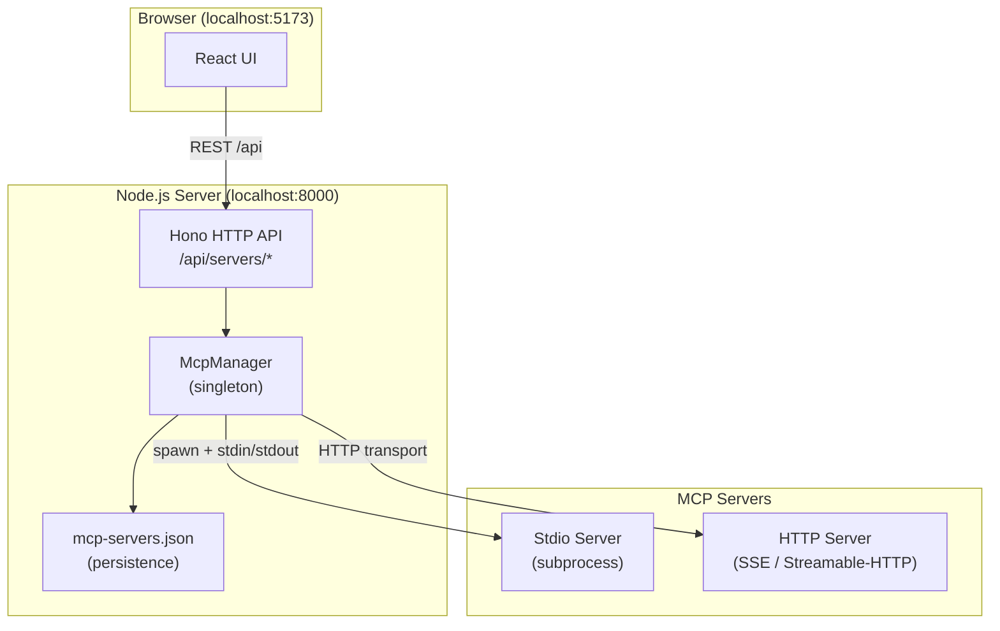

# MCP Playground

A web-based UI for connecting to, managing, and interacting with **Model Context Protocol (MCP)** servers. It lets you add servers (via stdio or HTTP), browse their tools, resources, and prompts, and call tools — all from a browser interface.

## Why?

Debugging MCP servers typically requires connecting them to an LLM, which costs tokens and money. MCP Playground lets you call tools, read resources, and inspect prompts directly — no LLM needed.

## Features

- 🔌 Connect to MCP servers over **stdio** (subprocess) or **HTTP** (SSE / Streamable HTTP)
- 🛠️ Browse and call **tools** exposed by any connected server
- 📄 Read **resources** and retrieve **prompts**
- 💾 Persist server configurations in `mcp-servers.json`
- 🗑️ Add, edit, and delete servers from the UI
- 🗂️ Stdio server processes run in isolated per-server directories under `.mcp-data/` (gitignored)
- ⚡ Hot-reload dev environment (server + client run concurrently)

## Tech Stack

| Layer | Technology |
|---|---|
| Backend | [Hono](https://hono.dev/) on Node.js (TypeScript) |
| Frontend | [React](https://react.dev/) + [Vite](https://vitejs.dev/) (TypeScript) |
| MCP SDK | [@modelcontextprotocol/sdk](https://github.com/modelcontextprotocol/typescript-sdk) |
| Runtime | [tsx](https://github.com/privatenumber/tsx) (no compile step in dev) |

## Architecture



## Getting Started

### Prerequisites

- Node.js 20+
- npm

### Install

```bash
npm install
npm --prefix client install
```

### Run (dev)

```bash
npm run dev
```

- **API server** → `http://localhost:8000`
- **UI** → `http://localhost:5173`

### Run (production)

```bash
npm run build
npm start
```

The Hono server will serve the built client from `http://localhost:8000`.

## Configuration

Server connections are persisted in `mcp-servers.json` at the project root. You can also manage them live through the UI or REST API.

**Stdio server example:**
```json
{
  "mcpServers": {
    "my-server": {
      "command": "node",
      "args": ["path/to/server.js"],
      "env": {}
    }
  }
}
```

**HTTP server example:**
```json
{
  "mcpServers": {
    "my-http-server": {
      "url": "http://localhost:3000/mcp",
      "transport": "sse"
    }
  }
}
```

> **Note:** `mcp-servers.json` is gitignored so your local server configs are never committed. Copy `mcp-servers.example.json` as a starting point:
> ```bash
> cp mcp-servers.example.json mcp-servers.json
> ```

> **Note:** Each stdio server process runs with its working directory set to `.mcp-data/<server-id>/`. This folder is created automatically and gitignored, so any files an MCP server creates (e.g. browser profiles, caches) stay out of the repo.

## API Reference

| Method | Path | Description |
|---|---|---|
| `GET` | `/api/servers` | List all servers |
| `POST` | `/api/servers` | Add a server |
| `PUT` | `/api/servers/:id` | Update a server |
| `DELETE` | `/api/servers/:id` | Remove a server |
| `POST` | `/api/servers/:id/connect` | Connect to a server |
| `POST` | `/api/servers/:id/disconnect` | Disconnect |
| `GET` | `/api/servers/:id/tools` | List tools |
| `POST` | `/api/servers/:id/tools/:tool/call` | Call a tool |
| `GET` | `/api/servers/:id/resources` | List resources |
| `POST` | `/api/servers/:id/resources/read` | Read a resource |
| `GET` | `/api/servers/:id/prompts` | List prompts |
| `POST` | `/api/servers/:id/prompts/:prompt/get` | Get a prompt |

## Contributing

Issues and PRs are welcome! Feel free to open an issue to report a bug or suggest a feature, or submit a pull request with your changes.
